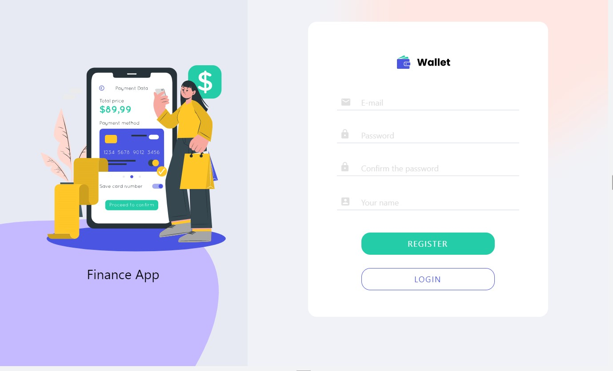
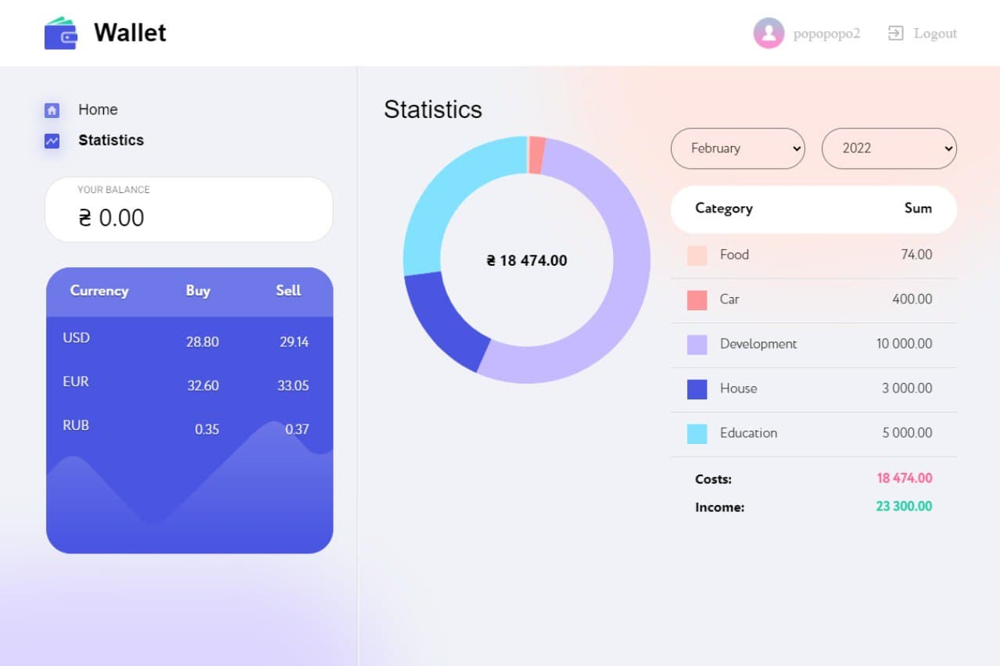

# PROJECT WALLET APP

## What is Wallet

Wallet is a online program for recording income, expenses and budget tracking.

## How does a WALLET APP work?

This one’s simple. Start by opening the mobile app onto your smartphone or other
compatible device. Create your account. Then take control of your finances,
which will allow you to make the right decisions and plan your future.

## Implemented functionality:

- User registration / login.
- Exchange ratebank via [api monobank](https://api.monobank.ua/docs/)
- Created its own [backend](https://github.com/Ponomaleks/wallet-app-backend) on
  which the site and all operations are running
- Adaptive layout with three breaks (mobile, tablet, desktop)
- The total balance of all amounts in the user's account is updated when adding
  transactions
- The user can add operations on his income and expenses at modal window, select
  a number, category, and also write the amount of the operation, which will be
  displayed on the statistics panel and the operations panel
  - Pop-up notifications about successful or unsuccessful operations using the
    package "react-toastify" for general statistics of the user's income and
    expenses
- Front End version deployed on Netlify, Back End - on Heroku.

## Technologies used

[React](https://ru.reactjs.org/),
[React-router-dom](https://v5.reactrouter.com/web/guides/quick-start),
[React-redux](https://react-redux.js.org/), [Material-ui](https://mui.com/),
[React-loader-spinner](https://www.npmjs.com/package/react-loader-spinner),
[React-media](https://www.npmjs.com/package/react-media),
[React-toastify](https://www.npmjs.com/package/react-toastify),
[Formik](https://formik.org/docs/overview),
[Uuid](https://www.npmjs.com/package/uuid),
[Yup](https://www.npmjs.com/package/yup),
[axios](https://www.npmjs.com/package/axios), [date-fns](https://date-fns.org/),
[modern-normalize](https://www.npmjs.com/package/modern-normalize)

## How to reach us

Here is our team and links to LinkedIn profiles:

- [Alexander Ponomarenko](https://www.linkedin.com/in/ponomalex/) - TeamLead
- [Alexander Baran](https://www.linkedin.com/in/alexander-baran-415091212/) -
  Scrum Master
- [Anna Savchuk](https://www.linkedin.com/in/anna-savchuk-b1759221b/) - Leading
  developer
- [Anna Pavlova](https://www.linkedin.com/in/anna-pavlova-80b88321b/) - Leading
  developer
- [Oleksandr Leiberiuk](https://www.linkedin.com/in/oleksandr-leiberiuk-a92778215/) -
  Leading developer
- [Roman Leshenko](https://www.linkedin.com/in/roman-leshchenko-467149220/) -
  Leading developer
- [Serhii Nechytailenko](https://www.linkedin.com/in/serhii-nechytailenko-0ab499215/) -
  Leading developer
- [Valerii Vitenko](https://www.linkedin.com/in/leroviten/) - Leading developer
